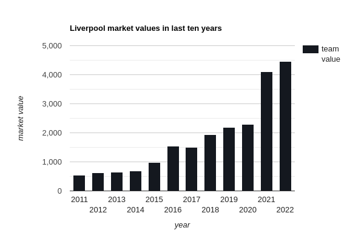
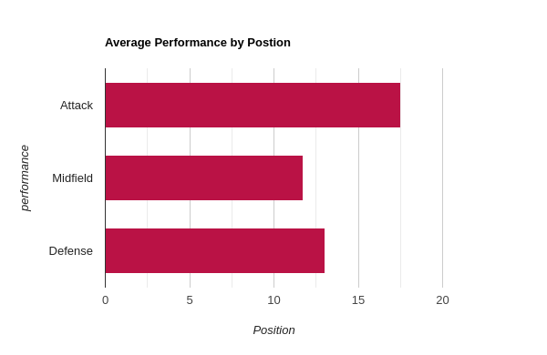
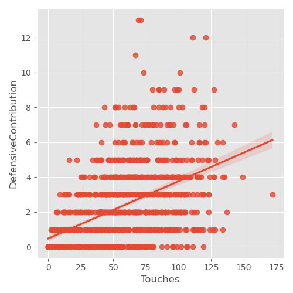
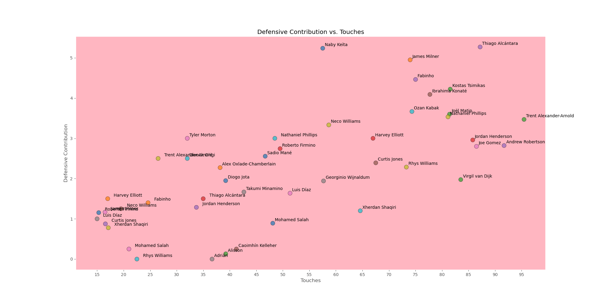
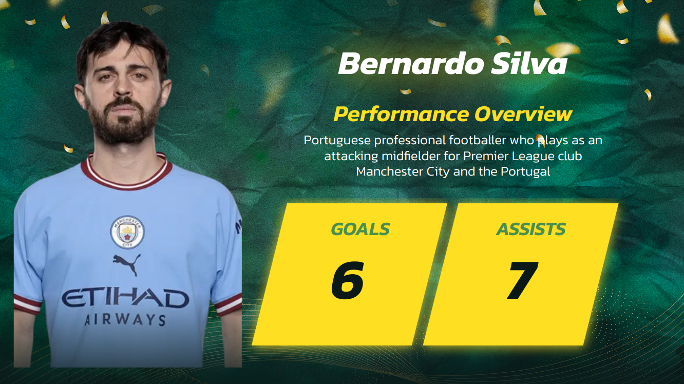
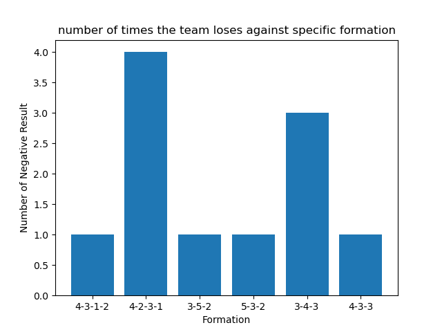
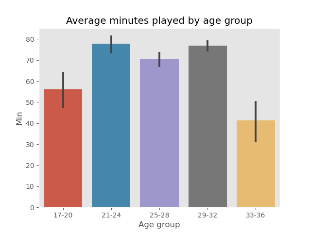

# DataKick

</a>

   

  <a href="" rel="noopener">

  DataKick
      

📝 Table of Contents
- [📙  Economic Landscape](#EcoLand)
- [🏁 Team Statistics Description](#Teamstat)
- [💻 Predicting the number of players needed  for each position ](#predPos)
- [📷 Suggesting players for the postion](#sugPos)
- [How opponent formation affect us](#oppForm)
- [How age can affect the performance](#agePerf)
- [Predicting the result of a match](#matchPred)

# 📙 Economic Landscape 
In this section, we will examine the significant market value surge experienced by the team during the 2019/2020 and 2020/2021 seasons, and explore the factors behind this growth while considering strategies to further double it.
 
 
</a>

# 🏁 Team Statistics Description 

While the team's overall performance has been reasonably strong, it is crucial to examine the midfield section more closely. This area has experienced a significant decline, which not only impacts player performance but also has implications for market value.
 
 
</a>

## Results Influencers
- Home Advantage (Anfield)
- Tactics 
- Accuracy of shooting on goal
- Exploiting free kicks
- Squad Depth and Player Rotation

## Performance Influencers
- Physical exertion
- The performance of the coach
- Rest between matches
- The presence of a player in a specific area of the field
- Squad Depth and Player Rotation

### Touches and their types vs Defensive performance

Through our analysis of the team's data, we have uncovered a relation between the types of touches and passes and their impact on defensive contribution. Additionally, the number of touches has proven to have a significant influence on defensive performance

**To enhance the defensive performance, we can leverage the identified correlation between touch types, their frequency, and defensive effectiveness. By allocating additional resources to training, focusing on improving passing skills, and ensuring higher accuracy in executing passes, we can optimize defensive outcomes. This strategic investment aims to strengthen defensive capabilities and ultimately elevate overall team performance**

### Players performance on the pitch 

We can observe that the nature of a player's touch has a significant impact on their defensive contribution. Specifically, let's focus on Virgil, who has a notable drawback in his performance related to dead touches.

Let's take a closer look at Alcantara, a talented player who deserves a thorough examination of his performance.

# Predicting the number of players needed  for each position 

- The System will assist the financial team in determining the level of players that Liverpool FC can afford and the quantity required to enhance the team's performance

- It can also support the club in analyzing data from other clubs and exploring potential player market opportunities, facilitating informed decision-making regarding player transfers and potential partnerships

- The system’s insights and predictions are expected to contribute to the overall performance enhancement of the team

The aforementioned tasks were accomplished using a machine learning model trained to predict the required number of players based on team statistics. By leveraging the power of the model, we were able to accurately estimate the optimal player count for each position. This approach enables data-driven decision-making, facilitating effective team management and resource allocation. The machine learning model analyzes team statistics and identifies patterns to provide reliable predictions, empowering coaches and clubs to make informed decisions when it comes to player selection and team composition.

# Suggesting players for the postion 

After predicting the required number of players for each position, the system will provide the coach and the club with recommendations of top-performing players in the current season. Initially, the system will suggest players exclusively from the Premier League. However, future versions of the project will include the capability to suggest players from outside the Premier League as well, Insha'Allah (ISA). This expansion will broaden the scope of player suggestions and offer more comprehensive options for team selection and recruitment.

## suggestion on another metric 

# How opponent formation affect us 

Analysis of the graph highlights the team's challenges when facing opponents utilizing the '4-2-3-1' formation, which is deemed unfavorable for a team of Liverpool's caliber. Consequently, it is imperative that proactive measures be taken to address this issue and devise appropriate strategies to counter such formations

# How age can affect the performance 

Analysis of the graph reveals that Liverpool has a substantial number of players, particularly in the 29-32 age range, who have accumulated a significant amount of playing time. This concentration of players in the midfield positions raises concerns about performance degradation in that area, as observed.

# Predicting the result of a match 

 - The prediction of match results is indeed a valuable and impactful feature in data analysis projects. It holds significant benefits for both coaching and business purposes. In our system, we have developed a linear regression model that predicts match outcomes before or during matches using live statistics. It is worth noting that achieving a 71% accuracy rate in predicting soccer match results is particularly impressive, considering the inherent difficulty in accurately forecasting such outcomes.

- This predictive capability offers substantial advantages. Coaches can leverage these predictions to make more informed decisions, devise effective strategies, and enhance team performance. Moreover, the predictions can also prove beneficial in the realm of betting, aiding individuals in making informed choices and potentially increasing the chances of successful outcomes.

 - By harnessing the power of data and employing advanced analytics techniques, our system delivers valuable insights that have the potential to revolutionize decision-making processes in the soccer industry.